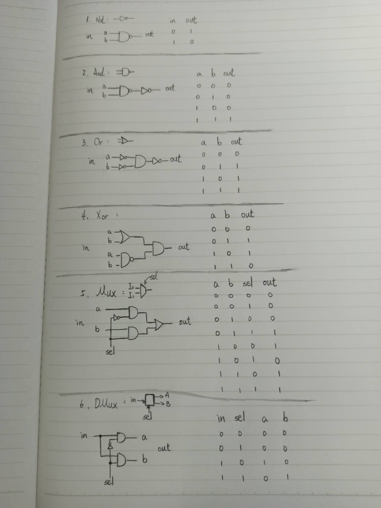

## 第一章前六題:

## 1.NOT
    Code:
        // This file is part of www.nand2tetris.org
        // and the book "The Elements of Computing Systems"
        // by Nisan and Schocken, MIT Press.
        // File name: projects/01/Not.hdl

        /**
          * Not gate:
          * out = not in
        **/

        CHIP Not {
            IN in;
            OUT out;

            PARTS:
            Nand(a = in, b = in, out = out);
        }

## 2.AND
    Code:
        // This file is part of www.nand2tetris.org
        // and the book "The Elements of Computing Systems"
        // by Nisan and Schocken, MIT Press.
        // File name: projects/01/And.hdl

        /**
          * And gate: 
          * out = 1 if (a == 1 and b == 1)
          * 0 otherwise
        **/

        CHIP And {
            IN a, b;
            OUT out;

            PARTS:
            Nand(a = a, b = b, out = nand);
	        Not(in = nand, out = out);
        }

## 3.OR
    Code:
        // This file is part of www.nand2tetris.org
        // and the book "The Elements of Computing Systems"
        // by Nisan and Schocken, MIT Press.
        // File name: projects/01/Or.hdl

        /**
          * Or gate:
          * out = 1 if (a == 1 or b == 1)
          * 0 otherwise
        **/

        CHIP Or {
            IN a, b;
            OUT out;

            PARTS:
            Not(in = a, out = not a);
	        Not(in = b, out = not b);
	        And(a = not a, b = not b, out = not ab);
	        Not(in = not ab, out = out);
        }

## 4.XOR
    Code:
        // This file is part of www.nand2tetris.org
        // and the book "The Elements of Computing Systems"
        // by Nisan and Schocken, MIT Press.
        // File name: projects/01/Xor.hdl

        /**
          * Exclusive-or gate:
          * out = not (a == b)
        **/

        CHIP Xor {
            IN a, b;
            OUT out;

            PARTS:
            Or(a = a, b = b, out = a or b);
	        Nand(a = a, b = b, out = a nand b);
	        And(a = a or b, b = a nand b, out = out);
        }

## 5.MUX
    Code:
        // This file is part of www.nand2tetris.org
        // and the book "The Elements of Computing Systems"
        // by Nisan and Schocken, MIT Press.
        // File name: projects/01/Mux.hdl

        /** 
          * Multiplexor:
          * out = a if sel == 0
          * b otherwise
        **/

        CHIP Mux {
	        IN a, b, sel;
	        OUT out;

	        PARTS:
	        Not(in = sel, out = not sel);
	        And(a = not sel, b = a, out = sel a);
	        And(a = sel, b = b, out = sel b);
	        Or(a = sel a, b = sel b, out = out);
        }
## 6.DMUX
    Code:
        // This file is part of www.nand2tetris.org
        // and the book "The Elements of Computing Systems"
        // by Nisan and Schocken, MIT Press.
        // File name: projects/01/DMux.hdl

        /**
          * Demultiplexor: 
          * {a, b} = {in, 0} if sel == 0
          * {0, in} if sel == 1
        **/

        CHIP DMux {
            IN in, sel;
            OUT a, b;

            PARTS:
            Not(in = sel, out = not sel);
	          And(a = not sel, b = in, out = a);
	          And(a = sel, b = in, out = b);
        }

