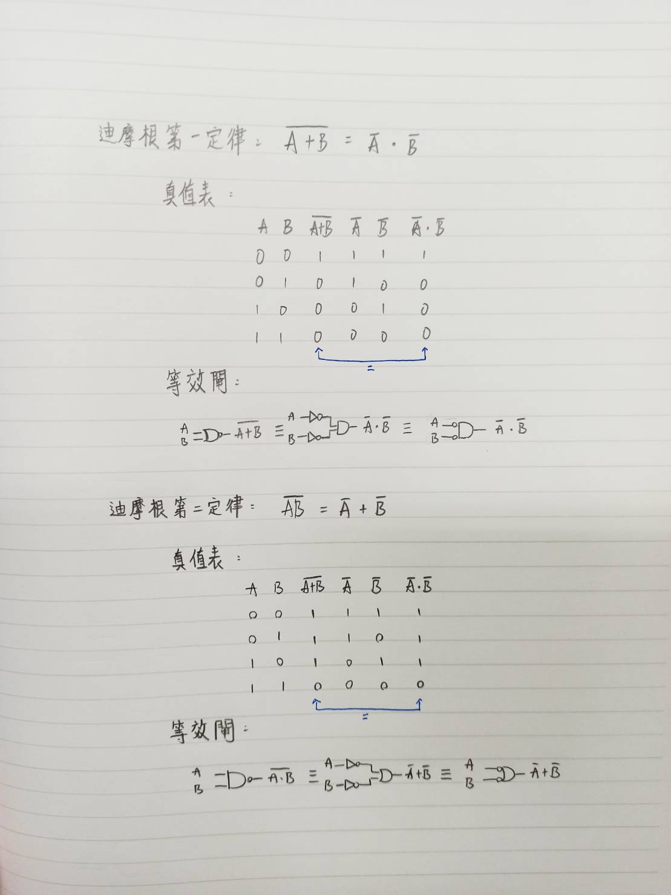
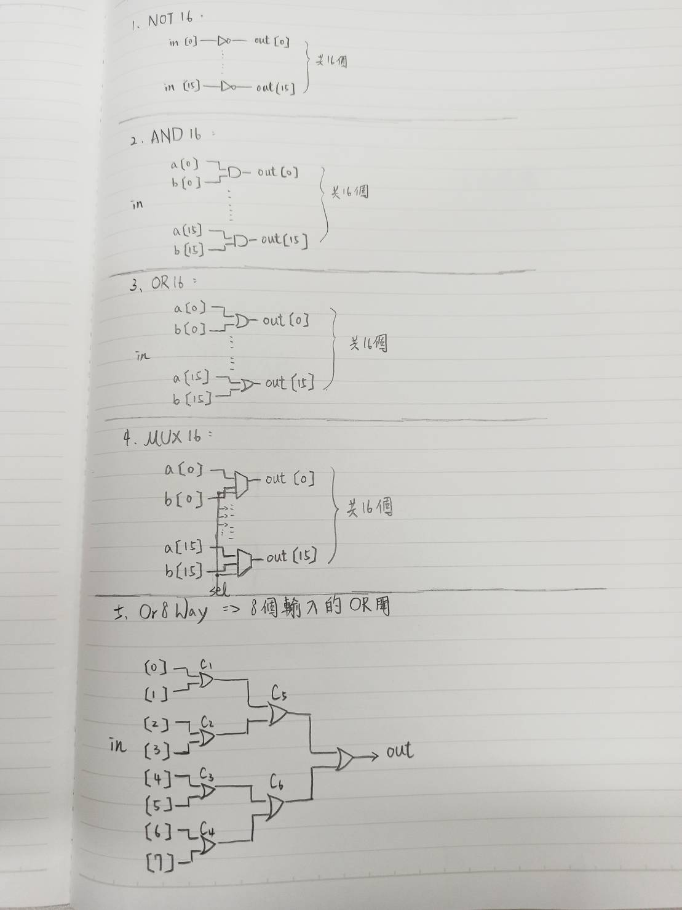

## 迪摩根定律證明：

## 第一章剩餘題目:

## 1.NOT16
    Code:
        // This file is part of www.nand2tetris.org
        // and the book "The Elements of Computing Systems"
        // by Nisan and Schocken, MIT Press.
        // File name: projects/01/Not.hdl

        /**
        * 16-bit Not gate: for i = 0..15;
        * out[i] = Not in[i]
        **/

        CHIP Not16 {
            IN in[16];
            OUT out[16];

            PARTS:
            Nand(a=in[0], b=in[0], out=out[0]);
            Nand(a=in[1], b=in[1], out=out[1]);
            Nand(a=in[2], b=in[2], out=out[2]);
            Nand(a=in[3], b=in[3], out=out[3]);
            Nand(a=in[4], b=in[4], out=out[4]);
            Nand(a=in[5], b=in[5], out=out[5]);
            Nand(a=in[6], b=in[6], out=out[6]);
            Nand(a=in[7], b=in[7], out=out[7]);
            Nand(a=in[8], b=in[8], out=out[8]);
            Nand(a=in[9], b=in[9], out=out[9]);
            Nand(a=in[10], b=in[10], out=out[10]);
            Nand(a=in[11], b=in[11], out=out[11]);
            Nand(a=in[12], b=in[12], out=out[12]);
            Nand(a=in[13], b=in[13], out=out[13]);
            Nand(a=in[14], b=in[14], out=out[14]);
            Nand(a=in[15], b=in[15], out=out[15]);
        }

## 2.AND16
    Code:
        // This file is part of www.nand2tetris.org
        // and the book "The Elements of Computing Systems"
        // by Nisan and Schocken, MIT Press.
        // File name: projects/01/And16.hdl

        /**
        * 16-bit-wise And gate: for i = 0..15;
        * out[i] = a[i] And b[i]
        **/

        CHIP And16 {
            IN a[16], b[16];
            OUT out[16];

            PARTS:
            And(a=a[0], b=b[0], out=out[0]);
            And(a=a[1], b=b[1], out=out[1]);
            And(a=a[2], b=b[2], out=out[2]);
            And(a=a[3], b=b[3], out=out[3]);
            And(a=a[4], b=b[4], out=out[4]);
            And(a=a[5], b=b[5], out=out[5]);
            And(a=a[6], b=b[6], out=out[6]);
            And(a=a[7], b=b[7], out=out[7]);
            And(a=a[8], b=b[8], out=out[8]);
            And(a=a[9], b=b[9], out=out[9]);
            And(a=a[10], b=b[10], out=out[10]);
            And(a=a[11], b=b[11], out=out[11]);
            And(a=a[12], b=b[12], out=out[12]);
            And(a=a[13], b=b[13], out=out[13]);
            And(a=a[14], b=b[14], out=out[14]);
            And(a=a[15], b=b[15], out=out[15]);
        }

## 3.OR16
    Code:
        // This file is part of www.nand2tetris.org
        // and the book "The Elements of Computing Systems"
        // by Nisan and Schocken, MIT Press.
        // File name: projects/01/And16.hdl

        /**
        * 16-bit-wise Or gate:for i = 0..15;
        * out[i] = a[i] Or b[i]
        **/

        CHIP Or16 {
            IN a[16], b[16];
            OUT out[16];

            PARTS:
            Or(a=a[0], b=b[0], out=out[0]);
            Or(a=a[1], b=b[1], out=out[1]);
            Or(a=a[2], b=b[2], out=out[2]);
            Or(a=a[3], b=b[3], out=out[3]);
            Or(a=a[4], b=b[4], out=out[4]);
            Or(a=a[5], b=b[5], out=out[5]);
            Or(a=a[6], b=b[6], out=out[6]);
            Or(a=a[7], b=b[7], out=out[7]);
            Or(a=a[8], b=b[8], out=out[8]);
            Or(a=a[9], b=b[9], out=out[9]);
            Or(a=a[10], b=b[10], out=out[10]);
            Or(a=a[11], b=b[11], out=out[11]);
            Or(a=a[12], b=b[12], out=out[12]);
            Or(a=a[13], b=b[13], out=out[13]);
            Or(a=a[14], b=b[14], out=out[14]);
            Or(a=a[15], b=b[15], out=out[15]);
        }

## 4.MUX16
    Code:
        // This file is part of www.nand2tetris.org
        // and the book "The Elements of Computing Systems"
        // by Nisan and Schocken, MIT Press.
        // File name: projects/01/And16.hdl

        /**
        * 16-bit multiplexor. If sel == 1 then out = b else out = a
        **/

        CHIP Mux16 {
            IN a[16], b[16], sel;
            OUT out[16];

            PARTS:
            Mux(a=a[0], b=b[0], sel=sel, out=out[0]);
            Mux(a=a[1], b=b[1], sel=sel, out=out[1]);
            Mux(a=a[2], b=b[2], sel=sel, out=out[2]);
            Mux(a=a[3], b=b[3], sel=sel, out=out[3]);
            Mux(a=a[4], b=b[4], sel=sel, out=out[4]);
            Mux(a=a[5], b=b[5], sel=sel, out=out[5]);
            Mux(a=a[6], b=b[6], sel=sel, out=out[6]);
            Mux(a=a[7], b=b[7], sel=sel, out=out[7]);
            Mux(a=a[8], b=b[8], sel=sel, out=out[8]);
            Mux(a=a[9], b=b[9], sel=sel, out=out[9]);
            Mux(a=a[10], b=b[10], sel=sel, out=out[10]);
            Mux(a=a[11], b=b[11], sel=sel, out=out[11]);
            Mux(a=a[12], b=b[12], sel=sel, out=out[12]);
            Mux(a=a[13], b=b[13], sel=sel, out=out[13]);
            Mux(a=a[14], b=b[14], sel=sel, out=out[14]);
            Mux(a=a[15], b=b[15], sel=sel, out=out[15]);
        }

## 5.OR8WAY
    Code:
        // This file is part of www.nand2tetris.org
        // and the book "The Elements of Computing Systems"
        // by Nisan and Schocken, MIT Press.
        // File name: projects/01/And16.hdl

        /**
        * 8-way Or gate: out = in[0] Or in[1] Or ... Or in[7]
        **/

        CHIP Or8Way {
            IN in[8];
            OUT out;

            PARTS:
            Or(a=in[0], b=in[1], out=c1);
            Or(a=in[2], b=in[3], out=c2);
            Or(a=in[4], b=in[5], out=c3);
            Or(a=in[6], b=in[7], out=c4);
            Or(a=c1, b=c2, out=c5);
            Or(a=c3, b=c4, out=c6);
            Or(a=c5, b=c6, out=out);
        }

## 6.MUX4WAY16
    Code:
        // This file is part of www.nand2tetris.org
        // and the book "The Elements of Computing Systems"
        // by Nisan and Schocken, MIT Press.
        // File name: projects/01/And16.hdl

        /**
        * 4-way 16-bit multiplexor.  
        * out = a if sel == 00
        * out = b if sel == 01
        * out = c if sel == 10
        * out = d if sel == 11
        **/

        CHIP Mux4Way16 {
            IN a[16], b[16], c[16], d[16], sel[2];
            OUT out[16];

            PARTS:
            Mux16(a=a, b=b, sel=sel[0], out=c1);
            Mux16(a=c, b=d, sel=sel[0], out=c2);
            Mux16(a=c1, b=c2, sel=sel[1], out=out);
        }

## 7.MUX8WAY16
    Code:
        // This file is part of www.nand2tetris.org
        // and the book "The Elements of Computing Systems"
        // by Nisan and Schocken, MIT Press.
        // File name: projects/01/And16.hdl

        /**
        * 4-way 16-bit multiplexor.  
        * out = a if sel == 000
        * out = b if sel == 001
        * out = c if sel == 010
        * out = d if sel == 011
        * out = e if sel == 100
        * out = f if sel == 101
        * out = g if sel == 110
        * out = h if sel == 111
        **/

        CHIP Mux8Way16 {
            IN a[16], b[16], c[16], d[16],
               e[16], f[16], g[16], h[16],
               sel[3];
            OUT out[16];

            PARTS:
            Mux4Way16(a=a, b=b, c=c, d=d, sel[0]=sel[0], sel[1]=sel[1], out=c1);
            Mux4Way16(a=e, b=f, c=g, d=h, sel[0]=sel[0], sel[1]=sel[1], out=c2);
            Mux16(a=c1, b=c2, sel=sel[2], out=out);
        }
## 8.DMUX4WAY
    Code:
        // This file is part of www.nand2tetris.org
        // and the book "The Elements of Computing Systems"
        // by Nisan and Schocken, MIT Press.
        // File name: projects/01/And16.hdl

        /**
        * 4-way demultiplexor.  
        * {a,b,c,d} = {in,0,0,0} if sel == 00
        * {a,b,c,d} = {0,in,0,0} if sel == 01
        * {a,b,c,d} = {0,0,in,0} if sel == 10
        * {a,b,c,d} = {0,0,0,in} if sel == 11
        **/

        CHIP DMux4Way {
            IN in, sel[2];
            OUT a, b, c, d;

            PARTS:
            DMux(in=in, sel=sel[1], a=c1, b=c2);
            DMux(in=c1, sel=sel[0], a=a, b=b);
            DMux(in=c2, sel=sel[0], a=c, b=d);
        }

## 9.DMUX8WAY
    Code:
        // This file is part of www.nand2tetris.org
        // and the book "The Elements of Computing Systems"
        // by Nisan and Schocken, MIT Press.
        // File name: projects/01/And16.hdl

        /**
        * 4-way demultiplexor.  
        * {a,b,c,d,e,f,g,h} = {in,0,0,0,0,0,0,0} if sel == 000
        * {a,b,c,d,e,f,g,h} = {0,in,0,0,0,0,0,0} if sel == 001
        * {a,b,c,d,e,f,g,h} = {0,0,in,0,0,0,0,0} if sel == 010
        * {a,b,c,d,e,f,g,h} = {0,0,0,in,0,0,0,0} if sel == 011
        * {a,b,c,d,e,f,g,h} = {0,0,0,0,in,0,0,0} if sel == 100
        * {a,b,c,d,e,f,g,h} = {0,0,0,0,0,in,0,0} if sel == 101
        * {a,b,c,d,e,f,g,h} = {0,0,0,0,0,0,in,0} if sel == 110
        * {a,b,c,d,e,f,g,h} = {0,0,0,0,0,0,0,in} if sel == 111
        **/

        CHIP DMux8Way {
            IN in, sel[3];
            OUT a, b, c, d, e, f, g, h;

            PARTS:
            DMux(in=in, sel=sel[2], a=c1, b=c2);
            DMux4Way(in=c1, sel[0]=sel[0], sel[1]=sel[1], a=a, b=b, c=c, d=d);
            DMux4Way(in=c2, sel[0]=sel[0], sel[1]=sel[1], a=e, b=f, c=g, d=h);
        }

