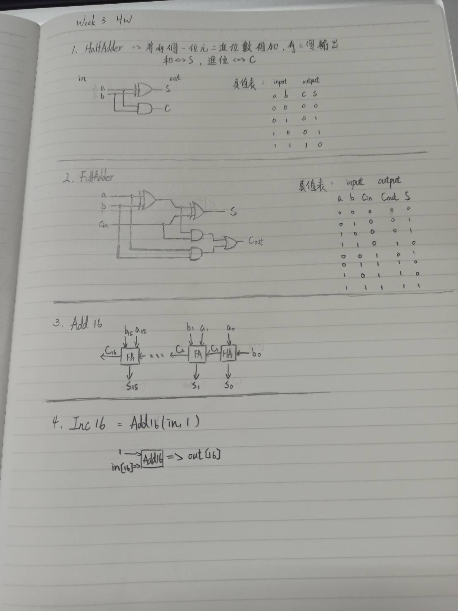

## 第二章前四題:

## 1.HalfAdder
    Code:
        // This file is part of www.nand2tetris.org
        // and the book "The Elements of Computing Systems"
        // by Nisan and Schocken, MIT Press.
        // File name: projects/02/HalfAdder.hdl

        /**
          * Computes the sum of two bits.
        **/

        CHIP HalfAdder {
            IN a, b;    // 1-bit inputs
            OUT sum,    // Right bit of a + b 
            carry;  // Left bit of a + b

            PARTS:
            Xor(a=a, b=b, out=sum);
            And(a=a, b=b, out=carry);
        }

## 2.FullAdder
    Code:
        // This file is part of www.nand2tetris.org
        // and the book "The Elements of Computing Systems"
        // by Nisan and Schocken, MIT Press.
        // File name: projects/02/FullAdder.hdl

        /**
          * Computes the sum of three bits.
        **/

        CHIP FullAdder {
            IN a, b, c;  // 1-bit inputs
            OUT sum,     // Right bit of a + b + c
            carry;   // Left bit of a + b + c

            PARTS:
            HalfAdder(a=a, b=b, sum=sumab, carry=carryab);
            HalfAdder(a=sumab, b=c, sum=sum, carry=carryabc);
            Or(a=carryab, b=carryabc, out=carry);
        }

## 3.Add16
    Code:
        // This file is part of www.nand2tetris.org
        // and the book "The Elements of Computing Systems"
        // by Nisan and Schocken, MIT Press.
        // File name: projects/02/Add16.hdl

        /**
          * Adds two 16-bit values.
          * The most significant carry bit is ignored.
        **/

        CHIP Add16 {
            IN a[16], b[16];
            OUT out[16];

            PARTS:
            HalfAdder(a=a[0], b=b[0], sum=out[0], carry=carry0);
            FullAdder(a=a[1], b=b[1], c=carry0, sum=out[1], carry=carry1);
            FullAdder(a=a[2], b=b[2], c=carry1, sum=out[2], carry=carry2);
            FullAdder(a=a[3], b=b[3], c=carry2, sum=out[3], carry=carry3);
            FullAdder(a=a[4], b=b[4], c=carry3, sum=out[4], carry=carry4);
            FullAdder(a=a[5], b=b[5], c=carry4, sum=out[5], carry=carry5);
            FullAdder(a=a[6], b=b[6], c=carry5, sum=out[6], carry=carry6);
            FullAdder(a=a[7], b=b[7], c=carry6, sum=out[7], carry=carry7);
            FullAdder(a=a[8], b=b[8], c=carry7, sum=out[8], carry=carry8);
            FullAdder(a=a[9], b=b[9], c=carry8, sum=out[9], carry=carry9);
            FullAdder(a=a[10], b=b[10], c=carry9, sum=out[10], carry=carry10);
            FullAdder(a=a[11], b=b[11], c=carry10, sum=out[11], carry=carry11);
            FullAdder(a=a[12], b=b[12], c=carry11, sum=out[12], carry=carry12);
            FullAdder(a=a[13], b=b[13], c=carry12, sum=out[13], carry=carry13);
            FullAdder(a=a[14], b=b[14], c=carry13, sum=out[14], carry=carry14);
            FullAdder(a=a[15], b=b[15], c=carry14, sum=out[15], carry=carry15);
        }

## 4.Inc16
    Code:
        // This file is part of www.nand2tetris.org
        // and the book "The Elements of Computing Systems"
        // by Nisan and Schocken, MIT Press.
        // File name: projects/02/Inc16.hdl

        /**
          * 16-bit incrementer:
          * out = in + 1 (arithmetic addition)
        **/

        CHIP Inc16 {
            IN in[16];
            OUT out[16];
            PARTS:
            Add16(a=in, b[0]=true, out=out);
        }
