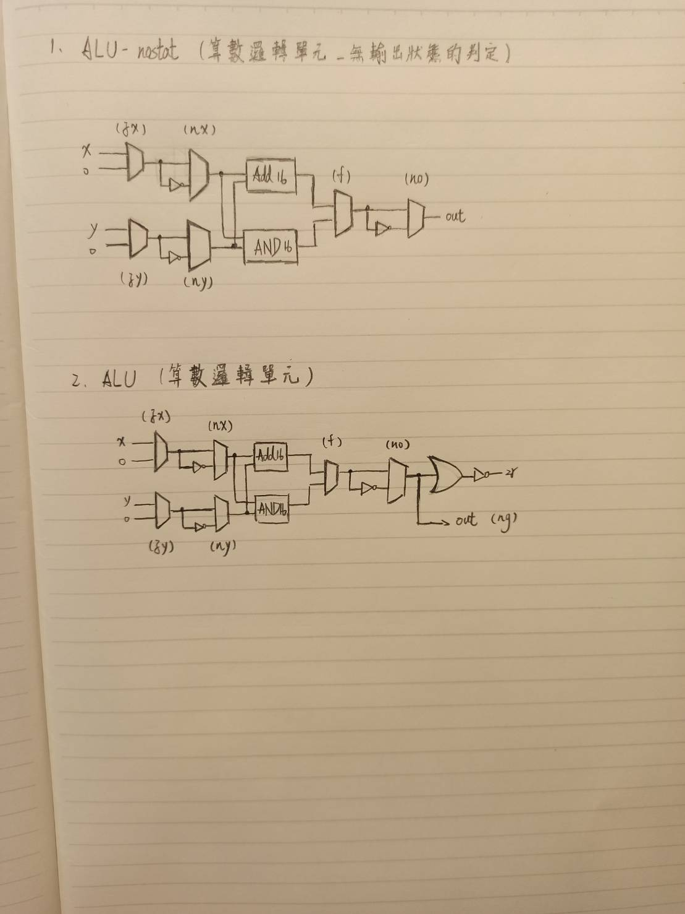

## 第二章剩餘:

## 1.ALU-nostat
    Code:
        // This file is part of www.nand2tetris.org
        // and the book "The Elements of Computing Systems"
        // by Nisan and Schocken, MIT Press.
        // File name: projects/02/ALU-nostat.hdl

        /**
          * The ALU (Arithmetic Logic Unit).
          * Computes one of the following functions:
          * x+y, x-y, y-x, 0, 1, -1, x, y, -x, -y, !x, !y,
          * x+1, y+1, x-1, y-1, x&y, x|y on two 16-bit inputs, 
          * according to 6 input bits denoted zx,nx,zy,ny,f,no.
          * In addition, the ALU computes two 1-bit outputs:
          * if the ALU output == 0, zr is set to 1; otherwise zr is set to 0;
          * if the ALU output < 0, ng is set to 1; otherwise ng is set to 0.
        **/

        // Implementation: the ALU logic manipulates the x and y inputs
        // and operates on the resulting values, as follows:
        // if (zx == 1) set x = 0        // 16-bit constant
        // if (nx == 1) set x = !x       // bitwise not
        // if (zy == 1) set y = 0        // 16-bit constant
        // if (ny == 1) set y = !y       // bitwise not
        // if (f == 1)  set out = x + y  // integer 2's complement addition
        // if (f == 0)  set out = x & y  // bitwise and
        // if (no == 1) set out = !out   // bitwise not
        // if (out == 0) set zr = 1
        // if (out < 0) set ng = 1

        CHIP ALU-nostat {
            IN  
                x[16], y[16],  // 16-bit inputs        
                zx, // zero the x input?
                nx, // negate the x input?
                zy, // zero the y input?
                ny, // negate the y input?
                f,  // compute out = x + y (if 1) or x & y (if 0)
                no; // negate the out output?

            OUT 
                out[16];

            PARTS:
            Mux16(a=x,  b=false,  sel=zx, out=x1);    // if (zx == 1) set x = 0  (zx)
            Not16(in=x1,out=notx1);
            Mux16(a=x1, b=notx1, sel=nx, out=x2);     // if (nx == 1) set x = !x (nx)
            Mux16(a=y,  b=false,  sel=zy, out=y1);    // if (zy == 1) set y = 0  (zy)
            Not16(in=y1,out=noty1);
            Mux16(a=y1, b=noty1, sel=ny, out=y2);     // if (ny == 1) set y = !y (ny)
            Add16(a=x2, b=y2, out=addxy);             // addxy = x + y
            And16(a=x2, b=y2, out=andxy);             // andxy = x & y
            Mux16(a=andxy, b=addxy, sel=f, out=o1);   // if (f == 1)  set out = x + y else set out = x & y
            Not16(in=o1, out=noto1);                  // noto1 = !o1
            Mux16(a=o1, b=noto1, sel=no, out=out);  // if (no == 1) set out = !out
        }

## 2.ALU
    Code:
        // This file is part of www.nand2tetris.org
        // and the book "The Elements of Computing Systems"
        // by Nisan and Schocken, MIT Press.
        // File name: projects/02/ALU.hdl

        /**
          * The ALU (Arithmetic Logic Unit).
          * Computes one of the following functions:
          * x+y, x-y, y-x, 0, 1, -1, x, y, -x, -y, !x, !y,
          * x+1, y+1, x-1, y-1, x&y, x|y on two 16-bit inputs, 
          * according to 6 input bits denoted zx,nx,zy,ny,f,no.
          * In addition, the ALU computes two 1-bit outputs:
          * if the ALU output == 0, zr is set to 1; otherwise zr is set to 0;
          * if the ALU output < 0, ng is set to 1; otherwise ng is set to 0.
        **/

        // Implementation: the ALU logic manipulates the x and y inputs
        // and operates on the resulting values, as follows:
        // if (zx == 1) set x = 0        // 16-bit constant
        // if (nx == 1) set x = !x       // bitwise not
        // if (zy == 1) set y = 0        // 16-bit constant
        // if (ny == 1) set y = !y       // bitwise not
        // if (f == 1)  set out = x + y  // integer 2's complement addition
        // if (f == 0)  set out = x & y  // bitwise and
        // if (no == 1) set out = !out   // bitwise not
        // if (out == 0) set zr = 1
        // if (out < 0) set ng = 1

        CHIP ALU {
            IN x[16], y[16], zx, nx, zy, ny, f, no;
            OUT out[16];

            PARTS:
            Mux16(a=x, b=false, sel=zx, out=xval1);         /* if zx then x=0 */
            Not16(in=xval1, out=notxval);
            Mux16(a=xval1, b=notxval, sel=nx, out=xval);    /* if nx then x=!x */
            Mux16(a=y, b=false, sel=zy, out=yval1);         /* if zy then y=0 */
            Not16(in=yval1, out=notyval);
            Mux16(a=yval1, b=notyval, sel=ny, out=yval);    /* if ny then y=!y */
            Add16(a=xval, b=yval, out=sum);
            And16(a=xval, b=yval, out=and);
            Mux16(a=and, b=sum, sel=f, out=out1);           /* if f then out=x+y else out=x&y */
            Not16(in=out1, out=notout);
            Mux16(a=out1, b=notout, sel=no, out=out2);      /* if no then out=!out */
            Or16Way(in=out2, out=outnonzero);
            Mux(a=true, b=false, sel=outnonzero, out=zr);   /* if out=0 then zr=1 else zr=0 */
            IsNeg16(in=out2, out=neg);
            Mux(a=false, b=true, sel=neg, out=ng);          /* if out<0 then ng=1 else ng=0 */
            Or16(a=out2, b=false, out=out);
        }

