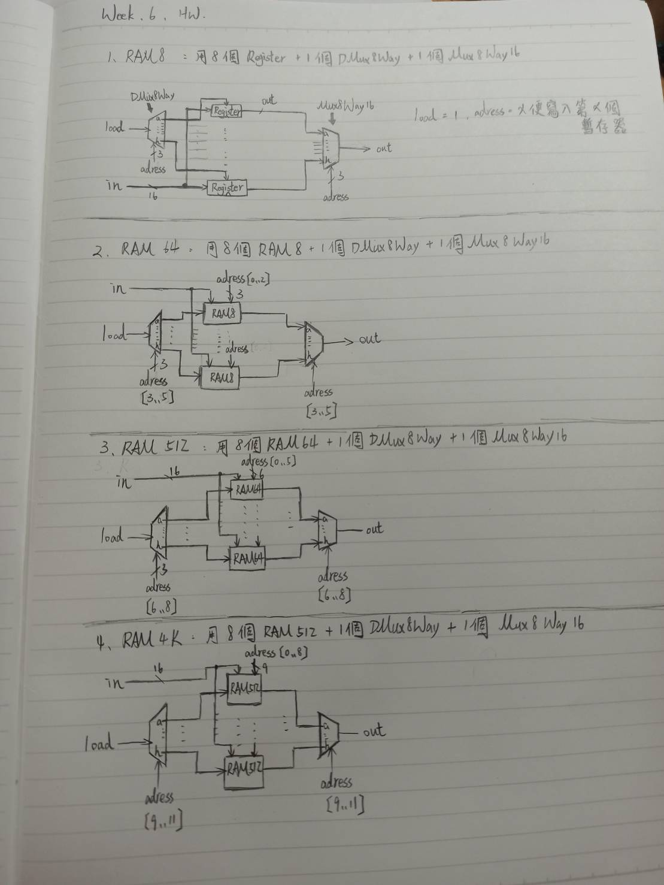

## 第三章 第四到八題:

## 1.RAM8
    Code:
        // This file is part of www.nand2tetris.org
        // and the book "The Elements of Computing Systems"
        // by Nisan and Schocken, MIT Press.
        // File name: projects/03/a/RAM8.hdl

        /**
          * Memory of 8 registers, each 16 bit-wide. Out holds the value
          * stored at the memory location specified by address. If load==1, then 
          * the in value is loaded into the memory location specified by address 
          * (the loaded value will be emitted to out from the next time step onward).
        **/

        CHIP RAM8 {
            IN in[16], load, address[3];
            OUT out[16];

            PARTS:
            DMux8Way(in=load, sel=address, a=L0, b=L1, c=L2, d=L3, e=L4, f=L5, g=L6, h=L7);
            Register(in=in, load=L0, out=r0);
            Register(in=in, load=L1, out=r1);
            Register(in=in, load=L2, out=r2);
            Register(in=in, load=L3, out=r3);
            Register(in=in, load=L4, out=r4);
            Register(in=in, load=L5, out=r5);
            Register(in=in, load=L6, out=r6);
            Register(in=in, load=L7, out=r7);
            Mux8Way16(a=r0, b=r1, c=r2, d=r3, e=r4, f=r5, g=r6, h=r7, sel=address, out=out);
        }

## 2.RAM64
    Code:
        // This file is part of www.nand2tetris.org
        // and the book "The Elements of Computing Systems"
        // by Nisan and Schocken, MIT Press.
        // File name: projects/03/b/RAM64.hdl

        /**
          * Memory of 64 registers, each 16 bit-wide. Out holds the value
          * stored at the memory location specified by address. If load==1, then 
          * the in value is loaded into the memory location specified by address 
          * (the loaded value will be emitted to out from the next time step onward).
        **/

        CHIP RAM64 {
            IN in[16], load, address[6];
            OUT out[16];

            PARTS:
            DMux8Way(in=load, sel=address[3..5], a=L0, b=L1, c=L2, d=L3, e=L4, f=L5, g=L6, h=L7);
            RAM8(in=in,  load=L0, address=address[0..2], out=o0);
            RAM8(in=in,  load=L1, address=address[0..2], out=o1);
            RAM8(in=in,  load=L2, address=address[0..2], out=o2);
            RAM8(in=in,  load=L3, address=address[0..2], out=o3);
            RAM8(in=in,  load=L4, address=address[0..2], out=o4);
            RAM8(in=in,  load=L5, address=address[0..2], out=o5);
            RAM8(in=in,  load=L6, address=address[0..2], out=o6);
            RAM8(in=in,  load=L7, address=address[0..2], out=o7);
            Mux8Way16(a=o0, b=o1, c=o2, d=o3, e=o4, f=o5, g=o6, h=o7, sel=address[3..5], out=out);
        }
## 3.RAM512
    Code:
        // This file is part of www.nand2tetris.org
        // and the book "The Elements of Computing Systems"
        // by Nisan and Schocken, MIT Press.
        // File name: projects/03/b/RAM512.hdl

        /**
          * Memory of 512 registers, each 16 bit-wide. Out holds the value
          * stored at the memory location specified by address. If load==1, then 
          * the in value is loaded into the memory location specified by address 
          * (the loaded value will be emitted to out from the next time step onward).
        **/

        CHIP RAM512 {
            IN in[16], load, address[9];
            OUT out[16];

            PARTS:
            DMux8Way(in=load, sel=address[6..8], a=L0, b=L1, c=L2, d=L3, e=L4, f=L5, g=L6, h=L7);
            RAM64(in=in,  load=L0, address=address[0..5], out=o0);
            RAM64(in=in,  load=L1, address=address[0..5], out=o1);
            RAM64(in=in,  load=L2, address=address[0..5], out=o2);
            RAM64(in=in,  load=L3, address=address[0..5], out=o3);
            RAM64(in=in,  load=L4, address=address[0..5], out=o4);
            RAM64(in=in,  load=L5, address=address[0..5], out=o5);
            RAM64(in=in,  load=L6, address=address[0..5], out=o6);
            RAM64(in=in,  load=L7, address=address[0..5], out=o7);
            Mux8Way16(a=o0, b=o1, c=o2, d=o3, e=o4, f=o5, g=o6, h=o7, sel=address[6..8], out=out);
        }
## 4.RAM4K
    Code:
        // This file is part of www.nand2tetris.org
        // and the book "The Elements of Computing Systems"
        // by Nisan and Schocken, MIT Press.
        // File name: projects/03/b/RAM4K.hdl

        /**
          * Memory of 4K registers, each 16 bit-wide. Out holds the value
          * stored at the memory location specified by address. If load==1, then 
          * the in value is loaded into the memory location specified by address 
          * (the loaded value will be emitted to out from the next time step onward).
        **/

        CHIP RAM4K {
            IN in[16], load, address[12];
            OUT out[16];

            PARTS:
            DMux8Way(in=load, sel=address[9..11], a=L0, b=L1, c=L2, d=L3, e=L4, f=L5, g=L6, h=L7);
            RAM512(in=in,  load=L0, address=address[0..8], out=o0);
            RAM512(in=in,  load=L1, address=address[0..8], out=o1);
            RAM512(in=in,  load=L2, address=address[0..8], out=o2);
            RAM512(in=in,  load=L3, address=address[0..8], out=o3);
            RAM512(in=in,  load=L4, address=address[0..8], out=o4);
            RAM512(in=in,  load=L5, address=address[0..8], out=o5);
            RAM512(in=in,  load=L6, address=address[0..8], out=o6);
            RAM512(in=in,  load=L7, address=address[0..8], out=o7);
            Mux8Way16(a=o0, b=o1, c=o2, d=o3, e=o4, f=o5, g=o6, h=o7, sel=address[9..11], out=out);
        }
## 5.RAM16K
    Code:
        // This file is part of www.nand2tetris.org
        // and the book "The Elements of Computing Systems"
        // by Nisan and Schocken, MIT Press.
        // File name: projects/03/b/RAM16K.hdl

        /**
          * Memory of 16K registers, each 16 bit-wide. Out holds the value
          * stored at the memory location specified by address. If load==1, then 
          * the in value is loaded into the memory location specified by address 
          * (the loaded value will be emitted to out from the next time step onward).
        **/

        CHIP RAM16K {
            IN in[16], load, address[14];
            OUT out[16];

            PARTS:
            DMux4Way(in=load, sel=address[12..13], a=L0, b=L1, c=L2, d=L3);
            RAM4K(in=in,  load=L0, address=address[0..11], out=o0);
            RAM4K(in=in,  load=L1, address=address[0..11], out=o1);
            RAM4K(in=in,  load=L2, address=address[0..11], out=o2);
            RAM4K(in=in,  load=L3, address=address[0..11], out=o3);
            Mux4Way16(a=o0, b=o1, c=o2, d=o3, sel=address[12..13], out=out);
        }
